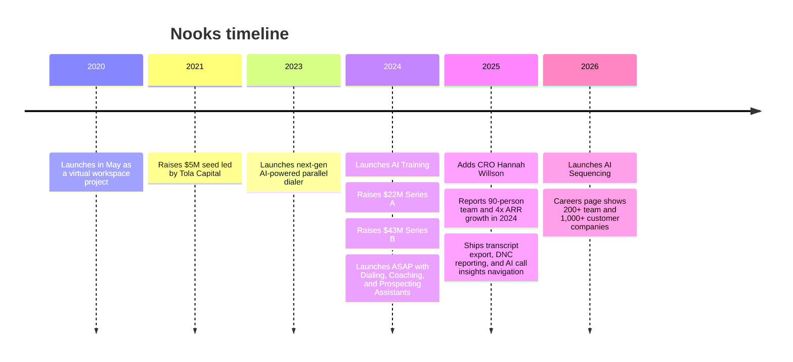
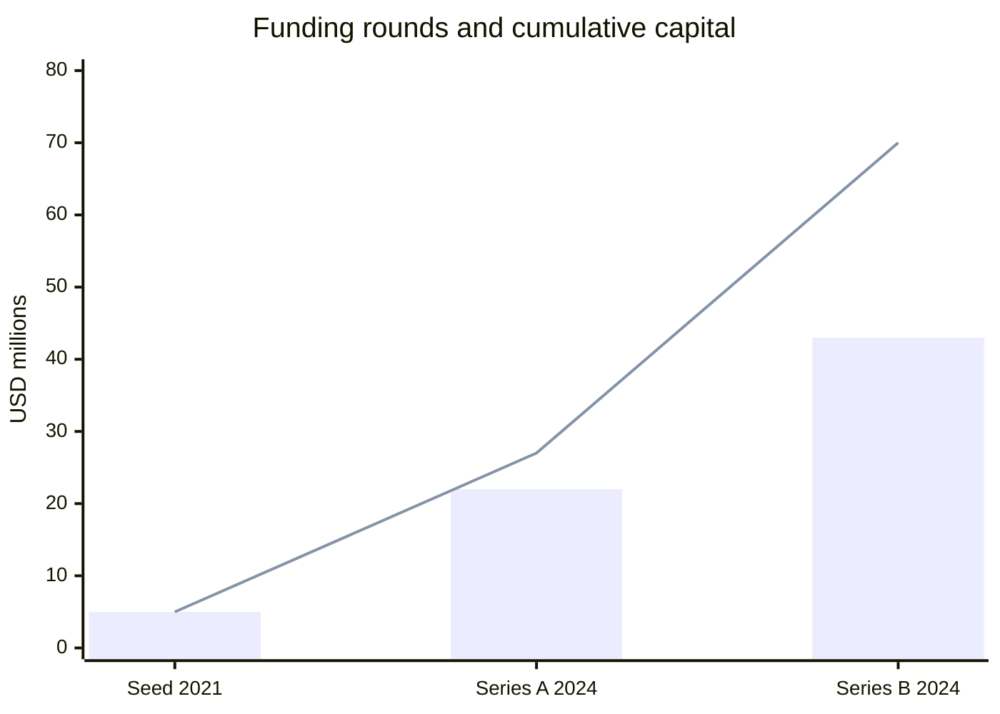
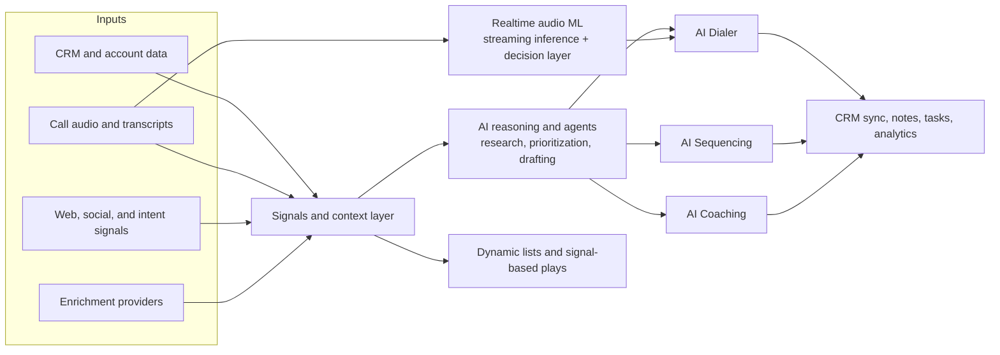

# Nooks Ground-Truth Report for a Job-Targeted AI App

## Executive summary

Nooks is best understood not as “just” a dialer company anymore, but as an AI-native outbound workspace that is trying to collapse prospecting, sequencing, calling, coaching, and signal detection into one operating layer for top-of-funnel revenue work. Its own current positioning uses phrases like “Agent Workspace for intelligent outbound” and “AI Sales Assistant Platform,” and its product family now spans AI Dialer, AI Sequencing, Signals & Intelligence, AI Coaching, and Contact Data Enrichment. Target users explicitly include SDRs, self-sourcing AEs, sales leaders, enablement, and RevOps. Pricing is quote-based; public line-item prices are unspecified. citeturn30search1turn11view3turn34view0

The most important cultural and product signal is philosophical, not cosmetic: Nooks repeatedly argues that the future is **human reps with AI assistants**, not full rep replacement. That stance shows up on the homepage, in the Series B announcement, in the company’s anti-“AI SDR spam” positioning, and in its careers language. If your app feels like an autonomous spam engine, it will likely read as culturally misaligned; if it feels like a rep-supercharging system with clear human control, it will likely read as native to Nooks. citeturn3view2turn4view1turn28view0turn19view0

From a technical perspective, the strongest public evidence points to two real moats. First is **real-time audio intelligence**: Nooks has published engineering details showing Twilio-streamed audio, manually labeled and self-labeled training data, a pre-trained audio encoder combined with Mamba state-space layers, and a tunable decision engine optimized across latency, precision, and recall. Second is **cross-workflow orchestration**: its signals pipeline runs on Temporal, with documented use of Node.js workers, gRPC-bound workload restructuring, Google Cloud Storage, Redis locks, and LLM-driven signal processing. That combination suggests Nooks cares deeply about low-latency, production-grade AI systems rather than thin prompt wrappers. citeturn26view5turn27view0turn27view5turn25view0turn25view2

The company has also scaled quickly. Public sources support a path from a May 2020 virtual-workspace startup to a 2026 company with 200+ employees, 1,000+ customer companies, millions of sales conversations processed, and $70M total disclosed funding across a $5M seed, $22M Series A, and $43M Series B. Official materials reviewed for this report do **not** disclose a valuation, so valuation is treated as unspecified here. citeturn33view1turn32search2turn34view0turn19view0turn14view0

For hiring, the signal is clear: Nooks appears to value people who can combine applied AI depth, product judgment, customer empathy, speed, and infrastructure rigor. The best portfolio app for this target company is one that demonstrates signal-to-action orchestration, human approvals, CRM-aware context, measurable revenue outcomes, and strong observability around latency, reliability, and model quality. citeturn19view1turn19view2turn21search1turn20view3

## Company overview and product surface

Nooks’s current product story is unusually coherent. The company’s homepage presents one unified workspace where reps work alongside AI agents across prospecting, sequencing, and dialing; the pricing page packages the offer into distinct but connected products; and the product pages describe how signals, sequences, calling, and coaching feed each other. This is not a loose bundle of point tools. It is a deliberate attempt to become the **system of action** for outbound pipeline generation. citeturn30search1turn11view3turn4view1

### Company snapshot

| Item | Ground-truth read |
|---|---|
| Current positioning | “Agent Workspace for intelligent outbound” / “AI Sales Assistant Platform.” citeturn30search1turn34view0 |
| Mission language | “Democratize growth,” “10x sellers,” and automate busywork so reps focus on the human part of selling. citeturn19view0turn20view6turn14view1 |
| Core users | SDRs, self-sourcing AEs, sales leaders, enablement, and RevOps. citeturn34view0 |
| Customer scale | 1,000+ companies; millions of sales conversations; 200+ employees on the careers page. citeturn19view0 |
| Pricing | Quote-based. The public pricing page says “Get in touch with the team to get a custom quote”; no public per-seat amounts are shown. citeturn11view3 |
| Public GitHub / patents | Unspecified in the reviewed public materials. |

### Product map

| Product | What it does | Evidence |
|---|---|---|
| AI Dialer | Parallel/power dialing, AI answer detection, automated number rotation, CRM sync, voicemail drops, dynamic smartlists, talk tracks, transcription, and virtual salesfloor collaboration. | citeturn11view3turn18search7 |
| AI Sequencing | Multi-channel execution across call, email, SMS, and social; AI prospect sourcing; signal-based triggers; context-aware drafting; deliverability controls. | citeturn6view0turn9view4turn9view6 |
| Signals & Intelligence | 100+ pre-built signals, custom signal builder, intent scoring, dynamic lists, AI account assistant, account research from calls/CRM/web/social. | citeturn10view1turn8view3turn8view4turn8view6 |
| AI Coaching | Auto-scoring calls, live battlecards, searchable call library, training bots, roleplay, scalable coaching, analytics, and AI call insights. | citeturn6view0turn8view0turn7view8turn7view7 |
| Contact Data Enrichment | Waterfall enrichment, number verification, mobile enrichment, and both partner pass-through data plus a Nooks data package. | citeturn10view1turn10view0 |

A notable detail is that Nooks increasingly describes these pieces as **tightly coupled** rather than simply integrated. The official Series B post says the Dialing, Coaching, and Prospecting Assistants are “tightly coupled,” so prospecting output informs calling, calls retrain roleplay, and shared personas travel across the system. That is the clearest public signal that Nooks is building toward an agentic platform, not a collection of discrete AI features. citeturn4view1

### Pricing and integration posture

The public pricing surface says far more about packaging than it does about money. Nooks is selling modular capabilities for dialing, sequencing, signals, coaching, and enrichment, but it withholds public price points and instead asks buyers to request a custom quote. At the same time, the pricing FAQ shows a pragmatic coexistence strategy: Nooks integrates with major CRM and data sources, can pass contact data via partner APIs, can export transcript data to customer-owned S3 buckets, and even notes that many firms continue using legacy signal tools while others consolidate onto Nooks. That suggests a deliberately flexible procurement path: land alongside existing infrastructure, then expand into consolidation. citeturn11view3turn10view0turn25view2

| Integrations and API-adjacent surface | Ground truth |
|---|---|
| CRMs | entity["company","HubSpot","crm software"] and entity["company","Salesforce","crm software"] are explicitly supported; CSV upload is the fallback for other CRMs. citeturn10view0 |
| Sales workflow tools | Nooks says it integrates with entity["company","Outreach","sales software"], entity["company","Salesloft","sales software"], and entity["company","Gong","revenue intelligence"]. citeturn10view1turn34view0 |
| Data vendors | Nooks explicitly names entity["company","Clay","data enrichment"], entity["company","ZoomInfo","sales intelligence"], entity["company","Cognism","b2b data"], and entity["company","LeadIQ","sales prospecting"]. citeturn10view0turn10view1turn34view0 |
| Customer-owned exports | Admins can export transcript data to their own AWS S3 bucket. citeturn25view2 |
| Public developer API docs | Unspecified in the reviewed materials; the public evidence is integration-oriented, not developer-platform-oriented. |

## Leadership, funding, and history

Nooks’s history matters because the company’s current positioning makes more sense when read as a pivot, not a greenfield build. The startup began as a virtual workspace product during the pandemic. Its founders discovered that sales teams were especially engaged, then pivoted toward AI-assisted outbound selling. That pivot is now central to the company narrative: remote collaboration became virtual salesfloor; calling became the core workflow; and that call data appears to have become the richest proprietary input into the broader agent workspace. citeturn33view1turn14view2turn3view2

### Leadership snapshot

| Role | Person | Evidence |
|---|---|---|
| CEO and co-founder | entity["people","Dan Lee","nooks ceo"] | Official funding, growth, and product posts identify him as CEO. citeturn14view0turn34view0 |
| Co-founder | entity["people","Nikhil Cheerla","nooks cofounder"] | Official founder-recognition post names him as one of the founders. citeturn14view2 |
| Co-founder | entity["people","Rohan Suri","nooks cofounder"] | Official founder-recognition post names him as one of the founders. citeturn14view2 |
| CRO | entity["people","Hannah Willson","nooks cro"] | Official March 2025 announcement. citeturn14view1 |
| Series A lead investor | entity["people","Lachy Groom","venture investor"] | Official Series A announcement. citeturn2view4 |
| Series B lead investor voice quoted publicly | entity["people","Mamoon Hamid","kleiner perkins partner"] | Official press release quote from the Series B launch. citeturn34view0 |

A useful nuance: the 2021 seed-era reporting named a fourth founder, Andrew Qu, in the earlier virtual-office incarnation, while recent official Nooks materials consistently frame the founders as Dan Lee, Nikhil Cheerla, and Rohan Suri. For a recruiting-grade ground truth, I would treat the current company’s official founder canon as the three names above and the earlier fourth name as part of the pre-pivot origin story. citeturn33view1turn14view2

### Funding, investors, and disclosed trajectory

| Date | Round | Amount | Lead / named participants | Ground-truth note |
|---|---|---:|---|---|
| Jul 2021 | Seed | $5M | Led by entity["company","Tola Capital","venture capital firm"], with participation from entity["company","Floodgate","venture capital firm"] and angel investors including Eventbrite leadership | Seed was raised when Nooks was still a virtual-workspace company. citeturn33view0 |
| Apr 2024 | Series A | $22M | Led by Lachy Groom, with additional investment from Tola Capital and entity["company","Stifel Venture Banking","venture banking"] | Official total funding after Series A: $27M. citeturn2view4turn3view1 |
| Oct 2024 | Series B | $43M | Led by entity["company","Kleiner Perkins","venture capital firm"], with participation from Lachy Groom and Tola Capital | Official total funding after Series B: $70M. Official valuation is unspecified in reviewed materials. citeturn34view0turn14view0 |

By January 2025, Nooks said it had completed its fourth straight year of record growth, 4x’ed ARR in 2024, expanded to 90 people from 30 at the start of the year, and reached hundreds of additional customers. By the current careers page, the company says it has grown to 200+ people, 1,000+ customer companies, and millions of sales conversations powered. citeturn14view0turn19view0

### Timeline

The timeline below is synthesized from official company posts plus the early seed reporting that documents the original virtual-workspace product. citeturn33view1turn30search15turn6view6turn2view4turn34view0turn14view1turn6view4turn19view0

### Funding chart

The chart uses only officially disclosed round amounts and cumulative totals from seed, Series A, and Series B announcements. citeturn33view0turn2view4turn34view0

## Product architecture, technical stack, and AI/ML approach

### High-confidence architecture read

Nooks’s public product and engineering writing points to a layered architecture: multi-source account data and buying signals feed an orchestration layer; a reasoning layer turns those signals into prioritization, messaging, and next-best actions; and product-specific surfaces deliver that intelligence into calling, sequencing, and coaching workflows. Separately, real-time telephony runs through a latency-sensitive audio ML path that supports answer detection, beep detection, and phone-tree navigation. The result is a system where outbound execution is not static workflow automation, but a feedback loop over calls, CRM state, web signals, and rep behavior. citeturn28view0turn28view4turn8view3turn9view4turn26view5turn27view0

The diagram below is an inference from the homepage architecture panel, the Signals & Intelligence and AI Sequencing product pages, and the engineering posts on audio intelligence and signal-pipeline orchestration. citeturn28view4turn9view4turn26view5turn27view5

### Public tech-stack evidence

| Area | Public evidence | What it strongly suggests | Confidence |
|---|---|---|---|
| Workflow orchestration | Large jobs, including the AI signals pipeline, run on entity["company","Temporal","workflow orchestration"]. citeturn27view0 | Durable workflow orchestration is a real part of the backend, not just incidental tooling. | High |
| Runtime / concurrency model | Nooks explicitly describes Node.js task-queue behavior, event-loop saturation, and heartbeat starvation in the signals pipeline. citeturn27view0 | At least part of the orchestration/backend stack is Node.js-based, likely TypeScript-heavy. | High |
| Messaging / RPC constraints | The signals re-architecture hit gRPC data limits before shifting large data externally. citeturn27view5 | Service boundaries are nontrivial and productionized enough to hit wire-size constraints. | High |
| Data movement | The same post says large payloads were moved into Google Cloud Storage handles. citeturn27view5 | There is a cloud-object-storage pattern in the job pipeline. | High |
| Caching / coordination | Nooks added a global Redis lock per signal/account to avoid duplicated LLM work. citeturn27view5 | The system uses distributed concurrency control around AI workloads and spend. | High |
| CI/CD | The CD post says Nooks consolidated CircleCI and GitHub Actions into a single GitHub Actions workflow in May 2025. citeturn25view0 | Modern trunk-based deployment and internal platform maturity. | High |
| Telephony | Audio packets buffer from entity["company","Twilio","communications platform"] in the answer-detection system. citeturn26view0 | Twilio is part of the telephony path today. | High |
| Customer data export | Transcript export to customer-owned AWS S3 buckets. citeturn25view2 | Enterprise-ish data portability and compliance posture. | High |
| Audio model design | A pre-trained audio encoder plus Mamba state-space layers powers low-latency detection. citeturn26view5 | Nooks is not relying only on third-party APIs for core audio intelligence. | High |
| Model ops / evaluation | The system uses manually labeled data, self-labeling over 10M production calls, a multimodal LLM ensemble, simulator-based detector tuning, and multi-objective optimization. citeturn26view1turn26view5 | Their ML practice includes data bootstrapping, offline evaluation, and workflow-specific threshold optimization. | High |

### AI and ML approaches

Nooks’s AI stack is not one thing. It appears to have at least **three distinct AI modes**. First is **streaming audio classification** for call handling; second is **LLM-style reasoning/generation** for research, drafting, and signal interpretation; third is **applied analytics/coaching** over transcripts and call outcomes. The company’s own product and engineering writing gives unusually strong support for this decomposition. citeturn26view5turn9view4turn8view0

| AI approach | Explicitly stated vs inferred | Evidence and read |
|---|---|---|
| Frontier-model-driven reasoning for agent workflows | Explicit | AI Sequencing says Nooks uses “frontier models” for agents that analyze context, connect signals across systems, and make decisions with structured reasoning. citeturn9view4 |
| Human-in-the-loop learning | Explicit | Homepage says agents learn from prospect and rep interactions and become more autonomous over time. Exact mechanism is unspecified. citeturn28view0turn28view1 |
| Retrieval over CRM, transcript, and web context | Strong inference | Product pages repeatedly say Nooks pulls from CRM, web, social, call transcripts, and first-/third-party signals to answer questions and produce outreach. That strongly implies a retrieval-heavy architecture, though the exact retrieval method is unspecified. citeturn8view6turn9view4turn28view4 |
| Call transcription, scoring, and searchable insights | Explicit | AI Coaching page and pricing page describe automatic recording, transcription, scoring, smart search, summaries, and topic/trend analysis. citeturn6view0turn8view0turn8view2 |
| AI roleplay / simulation from real calls | Explicit | Official materials say roleplay personas are built from real calls and simulate real prospect tone, objections, and languages. citeturn7view7turn4view1 |
| Signal ranking / intent scoring | Explicit | Signals & Intelligence includes intent scoring, 100+ pre-built signals, custom signals, and dynamic ranking of what matters each day. citeturn10view1turn8view3 |
| In-house model training | Explicit | Careers profiles include “training our most powerful in-house AI models from scratch.” citeturn20view2 |
| Approval-gated generation for outbound | Strong inference | The product surface includes rapid approval flow, deliverability safety rules, and human-in-the-loop language, which together imply approval-centric generation rather than blind autonomous send. citeturn10view1turn9view6turn28view0 |

### Why this matters for your application

The technical signal here is sharper than “they use AI.” Nooks seems to care about **latency, reliability, orchestration, and outcome-aware feedback loops** in addition to model quality. That means a portfolio app that only shows clever prompting but ignores queueing, failure modes, instrumentation, approvals, and CRM traceability will likely undershoot what they appear to value. citeturn25view0turn27view5turn26view5

## Go-to-market and business model

Nooks’s go-to-market model appears to be **ROI-led, modular, and increasingly platform-oriented**. The public pricing page is fully sales-led and quote-based, but the packaging is modular enough to support land-and-expand adoption: dialer, sequencing, signals, coaching, and enrichment can each be sold as a wedge, while the company’s messaging pushes buyers toward a single consolidated workspace. citeturn11view3turn10view0turn34view0

The likely motion is this: enter with a hard-dollar productivity or pipeline problem, prove lift quickly, then expand into adjacent workflows. Nooks’s own history supports that reading. The company began with calling because calls were the easiest place to show immediate ROI and because calls generated the richest top-of-funnel data. It then expanded into coaching, prospecting, and sequencing so the system could operate on more of the rep’s day. That sequence is not accidental; it is a classic wedge-to-platform strategy. citeturn3view2turn4view0turn6view4

The business model also looks intentionally flexible about replacement versus coexistence. Nooks says AI Sequencing can fully replace legacy sequencing platforms, yet the pricing FAQ also says many buyers continue to use their existing signal tools or primary data providers. In other words, Nooks is selling both **consolidation** and **compatibility**, which is a strong GTM choice for a fast-moving category where buyers do not all rip and replace on day one. citeturn10view0turn10view5

### GTM signals that matter

| Signal | What it says about the business |
|---|---|
| Current pricing path | Sales-led enterprise or mid-market motion; no self-serve public pricing. citeturn11view3 |
| Current buying center | Revenue teams, especially SDR leadership, AEs who self-source, enablement, and RevOps. citeturn34view0 |
| Expansion path | Product family now covers research, signals, dialing, sequencing, coaching, and enrichment. citeturn11view3turn34view0 |
| ROI proof style | Public proof points emphasize meetings, pipeline, ramp time, admin-time reduction, and conversation quality. citeturn10view1turn8view0 |
| Category stance | Against fully autonomous “AI SDR spam”; pro assistive, human-led AI. citeturn3view0turn4view1 |
| Competitive ambition | Public FAQ explicitly says Nooks can replace legacy sequencing and some signal tools. citeturn10view0 |

One especially important signal for your app is how Nooks talks about outcome metrics. Across product pages and proof points, the language is operational and revenue-tied: more email replies, more prospects surfaced, better connect rates, faster ramp time, more meetings, more pipeline, less admin work, and even sub-1% workflow failure after engineering changes. That means your app should not optimize for “AI wow” alone; it should optimize for **busyness removed and pipeline created**. citeturn6view1turn8view0turn26view5turn27view5

## Competitive landscape, differentiation, and strategic assessment

The cleanest way to position Nooks competitively is this: it sits between legacy sales-engagement incumbents and newer AI-native outbound systems, with a distinctive phone-first foundation. Its most direct strategic problem is not any single rival. It is that multiple adjacent categories are converging at once: AI prospecting, sequencing, dialing, coaching, conversation intelligence, and revenue orchestration. citeturn30search1turn36search4turn36search1turn36search2turn36search3turn37search0

### Competitor comparison

| Vendor | Official positioning | Overlap with Nooks | Read on relative differentiation |
|---|---|---|---|
| entity["company","Outreach","sales software"] | Agentic AI platform for revenue teams, spanning prospecting, deal management, forecasting, coaching, and account expansion. citeturn36search4turn36search0 | Broad overlap in prospecting, sequencing, coaching, and agent workflows. | Outreach looks broader across the full revenue lifecycle, but Nooks appears more phone-first and more tightly built around outbound execution and call-derived signals. citeturn30search1turn34view0turn3view2 |
| entity["company","Salesloft","sales software"] | Revenue orchestration platform unifying AI chat agents, sales engagement, conversation intelligence, forecasting, and workflows. citeturn36search1 | Broad overlap in sales engagement plus coaching/intelligence. | Salesloft reads like a large incumbent platform; Nooks reads like a more concentrated, top-of-funnel, AI-native entrant with stronger phone and signal-centered messaging. citeturn30search1turn11view3 |
| entity["company","Orum","sales dialer"] | AI-powered live conversation platform focused on dialing performance and coaching, sitting alongside existing SEP/CRM tools. citeturn36search2 | Strong overlap in parallel dialing, connect-rate optimization, and coaching. | Orum looks like the clearest dialer specialist. Nooks’s advantage is breadth: sequencing, signals, research, coaching, and enrichment in one workspace. citeturn11view3turn34view0 |
| entity["company","Regie.ai","sales engagement"] | AI-native sales engagement platform that combines human reps and AI agents, with AI dialer and intent-rich sequencing. citeturn36search3turn36search12turn36search6 | Very high overlap in AI-native sequencing, dialer, and signal-to-action execution. | This may be the closest conceptual peer. Nooks’s clearest public advantage is its phone-first origin and unusually detailed real-time audio/telephony engineering evidence. citeturn30search1turn25view1turn26view5 |
| entity["company","Apollo.io","sales intelligence"] | Unified AI sales platform for prospecting, data, outreach, automation, and dialer workflows. citeturn37search0turn37search8turn37search20 | Overlap in data plus outreach plus dialing. | Apollo’s strengths are likely breadth plus freemium accessibility. Nooks appears more enterprise-call-workflow-focused and more explicit about coaching, virtual salesfloor, and signal orchestration. citeturn11view3turn18search7turn8view0 |

### Where Nooks appears differentiated

Nooks’s clearest differentiation is **not** just “we also have AI.” Most rivals now say that. Instead, the strongest public differentiation appears to be a combination of four things.

First, Nooks is **phone-first** in a way many AI sales platforms are not. Its own funding post says calling was strategically important because reps actually used it, it showed ROI quickly, and calls generated the richest top-of-funnel data. That suggests the dialer is both a product wedge and a long-term data advantage. citeturn3view2

Second, Nooks is aggressively **human-in-the-loop**. That is both a product design choice and a category position. The company explicitly contrasts itself with AI SDR tools that spam buyers and churn quickly, while emphasizing assistants that empower reps. citeturn3view0turn4view1

Third, Nooks appears to have deeper **real-time audio ML credibility** than many companies in this category, at least in public materials. The engineering posts on answer detection and signal-pipeline reliability are unusually specific and production-flavored, which makes the product feel more like an applied AI systems company than a surface-level sales-AI wrapper. citeturn26view5turn27view5

Fourth, the company is trying to unify the “signal-to-action” loop: detect intent, rank accounts, draft messages, guide calls, coach reps, and learn from outcomes in one workspace. That is strategically stronger than selling separate widgets, if they can execute. citeturn8view3turn9view2turn28view4

### SWOT-style assessment

| Area | Assessment |
|---|---|
| Strengths | Strong platform cohesion; calls provide rich first-party behavior data; official growth and customer-impact claims are strong; engineering evidence suggests real applied-AI depth. citeturn4view1turn14view0turn26view5turn27view5 |
| Weaknesses | Public pricing is opaque; public API/developer surface is unspecified; broadening from dialer to full workspace increases product and execution complexity; dependence on multiple external systems and data vendors remains visible. citeturn11view3turn10view0turn34view0 |
| Opportunities | Replace legacy sequencing, unify fragmented signal tools, expand deeper into “next-best action” agent workflows, and turn call-driven data into a durable decisioning moat. citeturn10view5turn4view0turn9view4 |
| Risks | Incumbents are now also agentic; AI-native peers are converging on similar workflows; deliverability, telephony, and compliance regimes can shift; and buyer backlash against low-quality outbound automation remains real. citeturn36search4turn36search1turn36search2turn36search3turn3view0turn25view2 |

## Hiring signals and what they likely value

The careers page is one of the strongest sources in this report because it reveals not only open roles, but also how Nooks wants candidates to think about themselves. Nooks calls itself an “applied AI lab,” says it is building the future of growth one agent at a time, highlights team members working on real-time audio AI, deep GTM intelligence, low-latency infrastructure, security-by-design, and in-house models, and foregrounds company values like customer love, extreme ownership, speed, asking why, and basic human integrity. That is a very specific profile: high-agency product builders who can ship serious systems fast. citeturn19view0turn19view1turn19view2

### Likely roles and skills they value

| Signal | Evidence | What it likely means |
|---|---|---|
| Senior engineering hiring is active | Current careers snippets show roles such as Senior Software Engineer, Fullstack and Senior Software Engineer, Product, with San Francisco listed in the snippet. citeturn21search1 | They likely value end-to-end product engineers who can ship AI features into customer workflows, not just research prototypes. |
| Platform and low-latency infra matter | Careers profiles include platform engineering, low-latency infra, and developer velocity; engineering posts discuss deployment pipelines, orchestration, and event-loop behavior. citeturn20view0turn25view0turn27view0 | Backend/system design, concurrency, observability, and production reliability are meaningful differentiators. |
| Applied ML is central | Careers blurbs mention audio AI for real-time dialogue, GTM intelligence, and training in-house models from scratch. citeturn19view1turn20view2 | Strong candidates can talk concretely about training, evaluation, latency, retrieval, and online/offline feedback loops. |
| Security is a real function | Careers page names a lead security engineer and refers to secure-by-design product building. citeturn20view0 | Enterprise readiness matters; trust, privacy, and compliance are not afterthoughts. |
| Customer deployment is strategic | The current careers snippet includes an AI Deployment Strategist in Customer Success & Support with a published salary range. citeturn20view3 | Nooks likely values candidates who can bridge product/AI depth with customer implementation and change management. |
| Company values are explicit | “Earn customer love,” “Extreme ownership,” “Do more with less,” “Ask why,” “Be a good person.” citeturn19view1turn19view2 | In interviews, taste, ownership, and reasoning quality may matter as much as raw technical cleverness. |

### Practical read on culture

This does **not** read like a company optimizing for glossy demo AI. It reads like a company that wants serious builders who can operate on the boundary between research, product, and systems engineering. The “ask why” and “earn customer love” language also suggests that product reasoning and customer empathy are likely interview levers, not just implementation details. If you are applying with an app, you should be ready to explain not only *how* it works, but *why the workflow should exist at all*, *what business outcome it moves*, and *how you know the AI is actually helping*. citeturn19view1turn19view2

## How to tailor your app and application

### The most effective product thesis for your app

If you want your app to feel “Nooks-native,” anchor it around this thesis: **AI should remove busywork, surface the right context, and help a rep act faster and better, while keeping the rep in control.** That thesis matches the company’s homepage, product pages, and funding narrative much better than a thesis built around autonomous rep replacement. citeturn3view2turn28view0turn34view0

A strong app for this target should therefore look less like “AI SDR sends 10,000 messages” and more like **a compact agent workspace**: one place where account context, buying signals, prioritized prospects, draft outreach, call guidance, next-best action, and feedback loops all appear together. That maps directly to Nooks’s current architecture story. citeturn30search1turn28view4turn9view2

### What your app should prove

| What to build | Why it maps to Nooks | What good looks like in a demo |
|---|---|---|
| A unified rep workspace | Nooks is explicitly moving toward one workspace for prospecting, sequencing, dialing, and coaching. citeturn30search1turn28view2 | A single view with account brief, signal score, recommended prospects, draft message, call prep, and next-best action. |
| Signal-to-action orchestration | Signals & Intelligence plus AI Sequencing together define Nooks’s modern wedge. citeturn8view3turn8view4turn9view2 | Buying signal appears, account is re-ranked, recommended prospect set changes, and a draft sequence or call plan updates automatically. |
| Human approval and feedback memories | Nooks emphasizes human-in-the-loop learning and rapid approval flow. citeturn28view0turn10view1 | Every AI action can be approve/edit/reject, and those decisions visibly tune future suggestions. |
| Call-aware context | Calls are the company’s richest public data source and strategic wedge. citeturn3view2turn26view5 | Call summaries, objections, and prior outcomes feed future outreach recommendations and roleplay. |
| Reliability and observability | Nooks’s engineering writing is obsessed with failure rates, latency, and orchestration quality. citeturn27view5turn25view0 | Show p95 latency, workflow failure rate, sync health, and model confidence in the demo. |
| CRM traceability | Nooks repeatedly emphasizes CRM sync and account history. citeturn10view0turn28view4 | Every AI-generated recommendation links back to evidence and can write back to CRM/state cleanly. |

### Prioritized checklist

- [ ] **P0 — Build one coherent workflow, not five disconnected features.** A single rep workspace that ingests account context, detects signals, recommends a prospect, drafts a message, and prepares a call will read much stronger than a bag of AI gadgets. citeturn30search1turn28view4
- [ ] **P0 — Make the human control visible everywhere.** Add approve/edit/reject states, explanation traces, and an “evidence” panel showing which CRM, transcript, or web facts drove the recommendation. citeturn28view0turn8view6
- [ ] **P0 — Instrument reliability.** Show workflow success rate, model confidence, suggestion acceptance rate, and p95 latency. Nooks’s public engineering posture makes this disproportionately important. citeturn25view0turn27view5turn26view5
- [ ] **P0 — Tie everything to revenue outcomes.** Your readme, demo, and resume bullets should translate features into reply rate, connect rate, meeting rate, ramp time, admin-time reduction, or signal-sourced pipeline. citeturn6view1turn8view0turn10view1
- [ ] **P1 — Include a lightweight signal engine.** Even a mock engine that reranks accounts from CRM changes, job openings, pricing-page visits, or transcript events will feel aligned with Nooks’s strategy. citeturn8view3turn7view3
- [ ] **P1 — Add a coaching or roleplay loop.** If your app can generate a roleplay or dynamic talk track from historical objections, it will map well to AI Coaching. citeturn7view7turn7view8
- [ ] **P1 — Simulate enterprise-friendly controls.** Include deliverability safety limits, audit trails, DNC handling, or transcript-export hooks to show that you understand real buyer constraints. citeturn9view6turn25view2
- [ ] **P2 — If you touch voice, obsess over latency.** Even a mocked near-real-time assist panel should surface timing, confidence, and fallback behavior. Nooks clearly cares about realtime quality, not just capability. citeturn26view5

### Suggested interview talking points

- “I intentionally built this as **assistive AI**, not autonomous spam automation, because the highest-leverage parts of selling are still human.” citeturn3view2turn4view1
- “I treated **calls, CRM state, and web signals as a shared context layer**, because the best next action is usually cross-channel.” citeturn28view4turn9view4
- “I measured success in **pipeline-adjacent metrics**, not generic model metrics alone.” citeturn6view1turn8view0turn10view1
- “I added **approval loops and observability** because production AI systems fail operationally before they fail conceptually.” citeturn25view0turn27view5
- “I care about **latency and reliability** because user trust disappears when helpful AI arrives too slowly or inconsistently.” citeturn26view5turn27view0
- “I thought about **adoption and behavior change**, not just feature output, because the goal is to change rep workflows.” citeturn28view0turn34view0

### Sample OKRs your app could demonstrate

These sample OKRs intentionally mirror Nooks’s own public success language: more replies, more meetings, faster ramp, less admin time, better pipeline, and workflow reliability. citeturn6view1turn8view0turn10view1turn27view5

| Objective | Example key results |
|---|---|
| Make reps dramatically more productive without removing human control | Reduce manual account-research time by 60%; keep median recommendation latency under 1 second; achieve 80% recommendation explainability coverage; maintain human approval on 100% of outbound sends. |
| Increase top-of-funnel efficiency | Improve email reply rate by 20%; increase connect-to-meeting conversion by 15%; surface 30% more viable prospects per rep per week; attribute 25% of meetings to signal-driven prioritization. |
| Turn every interaction into a learning loop | Reach 70% weekly active usage among pilot reps; achieve a 50%+ accept-or-edit rate on AI suggestions; reduce manual follow-up logging by 80%. |
| Make the system trustworthy enough for production | Keep workflow failure rate below 1%; CRM sync success above 99.5%; hallucination rate below 2% on audited suggestions; log and review every rejected AI action. |

### Application framing that is likely to land well

In your resume, portfolio, or outreach note, lead with the workflow and the business effect, not only the model stack. A strong opener would sound like this: *I built a human-in-the-loop outbound workspace that turns CRM, call, and web context into prioritized next-best actions, draft messaging, and coaching loops, with reliability and latency instrumentation designed for production.* That framing aligns with Nooks’s current strategy much better than “I built an autonomous SDR agent.” citeturn30search1turn28view0turn26view5

If you include a short “why Nooks” paragraph, the best angle is probably: **phone-first data moat + human-led AI + integrated signal-to-action platform**. That is the most defensible synthesis of their official materials, and showing that you understood that synthesis is itself a signal of fit. citeturn3view2turn4view1turn28view4